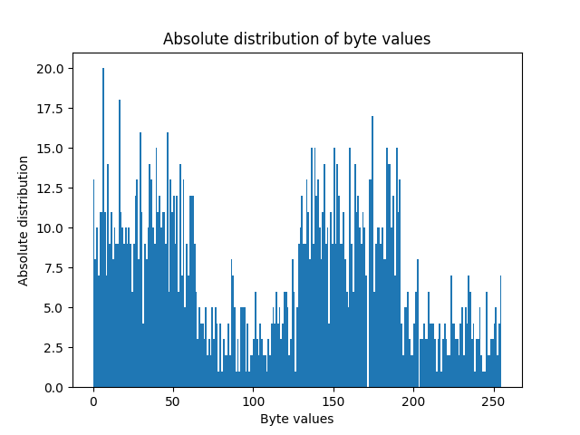

# Create Histogram
This python script creates histograms from a given file by reading it byte-wise.

The file `data.bin` is provided and serving as exemplary data:



## Installation
Install the required modules with the following command:
```shell
pip install -r requirements.txt
```

## Usage
```shell
python3 create_histogram.py [-h] [-p] filename
```